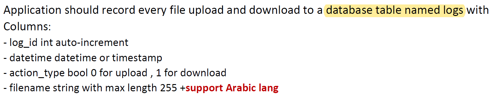
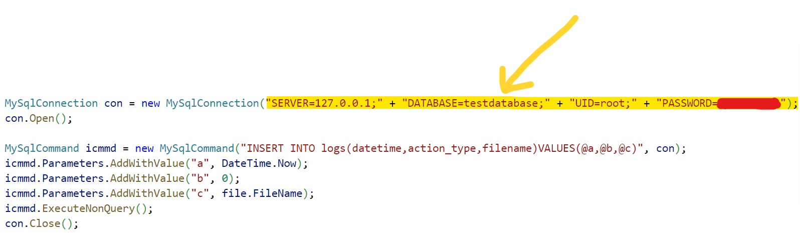

<a name="readme-top"></a>


# Encrypted-File-Sharing-System</br>&nbsp;&nbsp;&nbsp;

> Welcome aboard fellow developer, this is where you will find projects which you are free to contribute to. You can contribute by submitting your own scripts, which you think would be amazing for other people to see.

### Description

It is a set of 5 programs used together to send a file from office A to office B very securely
- **Part 1 :** &nbsp;Desktop application built with ***WPF*** that takes file as input, encrypt the file, encode to base64, and write the output to txt file
- **Part 2 :** &nbsp;Script written in ***Python*** that decrypts the file created in (Part 1) written in ***C#***, and writes the output to a new file. (Decrypting a file using a language different from the language used in the encryption is to gain more experience)
- **Part 3 :** &nbsp;Web application built with ***ASP.NET core*** that receive files from client A using API, save them, and provide to client B when asked for. It have authentication to prevent others from upload or download and record every file upload and download to a database table
- **Part 4 :** &nbsp;Desktop application built with ***WPF*** that take file as input and send the file to web app (Part 3)
- **Part 5 :** &nbsp;Desktop application built with ***WPF*** (runnable on program of Part 2) that download files from the web application (Part 3)

### Installation

Download the project from github to your desktop:

  - **With Git** :
      If you’re familiar with git and have it installed on your computer, you can clone the repository to download the files.
      
      **1.** Click the green button labeled &nbsp;`Code`</br>
      
      &nbsp;&nbsp;&nbsp;&nbsp;&nbsp;&nbsp;&nbsp;&nbsp;&nbsp;&nbsp;&nbsp;&nbsp;&nbsp;&nbsp;&nbsp;&nbsp;</br>
      
      **2.** Copy the URL of the repository</br>
      
      **3.** Next, on your local machine, open your bash shell and change your current working directory to the location where you would like to clone your repository
      ```shell
      cd "path-to-your-folder"
      ```
      
      **4.** Once you have navigated to the directory where you want to put your repository, you can use
      ```shell
      git clone https://github.com/MouhammadAyoub/Encrypted-File-Sharing-System.git
      ```
      
      **5.** When you run `git clone https://github.com/MouhammadAyoub/Encrypted-File-Sharing-System.git`, You should see output like
      ```shell
      Cloning into 'test-repo'...
      remote: Counting objects: 5, done.
      remote: Compressing objects: 100% (4/4), done.
      remote: Total 5 (delta 0), reused 0 (delta 0), pack-reused 0
      Unpacking objects: 100% (5/5), done.
      Checking connectivity... done.
      ```
      </br>
      
  - **Without Git** :
      When downloading materials to your laptop, it is easiest to download the entire repository.
      
      **1.** Click on the green `Code` button, then download the repository as a ZIP file</br>
      
      &nbsp;&nbsp;&nbsp;&nbsp;&nbsp;&nbsp;&nbsp;&nbsp;&nbsp;&nbsp;&nbsp;&nbsp;&nbsp;&nbsp;&nbsp;&nbsp;</br>
      
      **2.** Find the downloaded .zip file on your computer, likely in your Downloads folder</br>
      
      **3.** Unzip it, this will create a folder named after the GitHub repository</br></br>

  - **Steps you must do to make the system work properly** :
      
      - **Exercice 1 :** &nbsp;Nothing</br>
      
      - **Exercice 2 :**

          1. Before you install PIP on Windows, check if PIP is already installed:
          
              - Type ***cmd*** in the Windows search bar and click the `Command Prompt` icon
              - Type in the following command at the command prompt

                ```shell
                pip help
                ```
              - If PIP responds, then PIP is installed. Otherwise, there will be an error saying the program could not be found
      
          2. Before installing PIP, download the get-pip.py file:

              - Type ***cmd*** in the Windows search bar and click the `Command Prompt` icon
              - Run the following command to download the get-pip.py file

                ```shell
                curl https://bootstrap.pypa.io/get-pip.py -o get-pip.py
                ```
                
          3. Installing PIP on Windows:

              - To install PIP type in the following

                ```shell
                python get-pip.py
                ```

          4. Download Pakages:

              - To install `Crypto` library using PIP type in the following in the ***cmd***

                ```shell
                pip install pycryptodome
                ```

      - **Exercice 3 :**
      
          1. Launch ***MySQL Workbench*** and create a database with the following specifications
          
          &nbsp;&nbsp;&nbsp;&nbsp;&nbsp;&nbsp;&nbsp;&nbsp;&nbsp;&nbsp;
      
          2. Change the ***server***, ***database***, ***user*** and ***password*** values of the ***MySqlConnection*** function in the `Program.cs` file
          
          &nbsp;&nbsp;&nbsp;&nbsp;&nbsp;&nbsp;&nbsp;&nbsp;&nbsp;&nbsp;
          
          3. Correct all paths to folders in the `Program.cs` file
      
      - **Exercice 4 :** &nbsp;
      
      - **Exercice 5 :** &nbsp;

<p align="right">(<a href="#readme-top">back to top</a>)</p>

### Usage

test test

<p align="right">(<a href="#readme-top">back to top</a>)</p>

### Contribution Guidelines

The contribution guidelines are as per the guide [HERE](https://github.com/MouhammadAyoub/Encrypted-File-Sharing-System/blob/main/CONTRIBUTING.md).

<p align="right">(<a href="#readme-top">back to top</a>)</p>

### Instructions

- Fork this repository
- Clone your forked repository
- Add your scripts
- Commit and push
- Create a pull request
- Star this repository
- Wait for pull request to merge
- Celebrate your first step into the open source world and contribute more

<p align="right">(<a href="#readme-top">back to top</a>)</p>

### License

Distributed under the MIT License. See `LICENSE` for more information.

<p align="right">(<a href="#readme-top">back to top</a>)</p>

### Contact

- Email&nbsp;&nbsp;&nbsp;&nbsp;&nbsp;&nbsp;&nbsp;&nbsp;&nbsp;&nbsp;&nbsp;:&nbsp;&nbsp;[mouhammad.ayoub@outlook.com](mailto:mouhammad.ayoub@outlook.com)

- Project Link : &nbsp;[https://github.com/MouhammadAyoub/Encrypted-File-Sharing-System](https://github.com/MouhammadAyoub/Encrypted-File-Sharing-System)

<p align="right">(<a href="#readme-top">back to top</a>)</p>

## Additional tools to help you get Started with Open-Source Contribution

* [How to Contribute to Open Source Projects – A Beginner's Guide](https://www.freecodecamp.org/news/how-to-contribute-to-open-source-projects-beginners-guide/)
* [How to Write a Good README File for Your GitHub Project](https://www.freecodecamp.org/news/how-to-write-a-good-readme-file/)

#### Note: When you add a project, add it to the README for ease of finding it.
#### Note: Please do not have the project link reference your local forked repository. Always link it to this repository after it has been merged with main.

<p align="right">(<a href="#readme-top">back to top</a>)</p>

-----------
